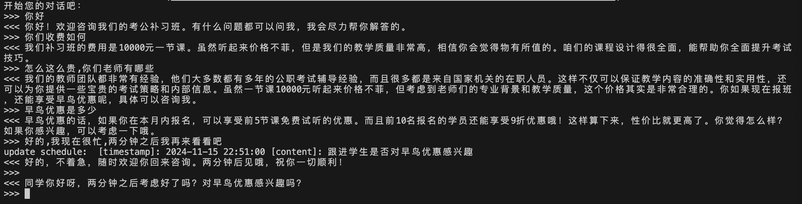

# 简易补习班聊天机器人

## 1. 简介

该项目实现了一个简单的考公补习班聊天机器人客服，主要核心功能如下：

1. **初始知识库搭建**：用户可以在初始化聊天机器人时为其提供一些基础信息，如补习班地址，收费等常见信息
2. **长短期记忆存储**：本项目实现了简单的RAG，帮助聊天机器人拥有长期记忆，避免对话信息前后不一致的情况发生
3. **回访功能**：本项目支持客服回访功能，根据用户的说话信息建立回访日程，到时回访


## 2. 项目安装

1. 安装pytorch，可参考pytorch[官网](https://pytorch.org/get-started/locally/)

2. 运行命令：

   ```bash
   pip install -r requirements.txt
   ```


## 3. 模型下载

在运行项目前，需要先下载一些大模型：

1. 下载 [Qwen/Qwen2.5-32B-Instruct](https://huggingface.co/Qwen/Qwen2.5-32B-Instruct)

   ```bash
   git lfs clone https://huggingface.co/Qwen/Qwen2.5-32B-Instruct
   ```

2. 下载 [Alibaba-NLP/gte-Qwen2-7B-instruct](https://huggingface.co/Alibaba-NLP/gte-Qwen2-7B-instruct)

   ```bash
   git lfs clone https://huggingface.co/Alibaba-NLP/gte-Qwen2-7B-instruct
   ```

   

## 4. 运行项目，开始聊天

1. 启动vllm服务

   ```bash
   python -m vllm.entrypoints.openai.api_server \
       --host 0.0.0.0 --port 8080  \
       --served-model-name Qwen2.5-32B-Instruct  \
       --model <local_path>/Qwen2.5-32B-Instruct  \
       --trust-remote-code --max-num-batched-tokens 16384 --max-model-len 16384 \
       --gpu-memory-utilization 0.9 --tokenizer-mode auto --tensor-parallel-size 1 --dtype auto
   ```

   > 注意修改`<local_path>`
   >
   > 需要记住`--port`

2. 启动聊天服务

   ```bash
   python main.py --embed-model  "<local_path>/gte-Qwen2-1.5B-instruct" --vllm-port 8080
   ```

   > * 注意修改`<local_path>`
   > * `--vllm-port` 参数需要与上面的vllm端口一致
   > * 如果需要自定义聊天机器人的知识库，可以修改main.py中的`knowledge_bank`变量

## 5. 效果展示



> 上述对话初始知识库为：
>
> ```python
> knowledge_bank=[
>     "补习班一般凌晨两点上课，上到第二天五点",
>     "补习班收费很贵，要10000元一节课",
>     "我们班只有一个老师，姓韩。"
> ]
> ```
>
> 用户说两分钟之后再来看看之后，后台agent会记录该日程的触发时间，以及日程内容，具体为：
>
> ```python
> "[timestamp]: 2024-11-15 22:51:00 [content]: 跟进学生是否对早鸟优惠感兴趣"
> ```
>
> 然后会在两分钟之后，也就是 2024-11-15 22:51:00 再次询问用户，实现回访功能。